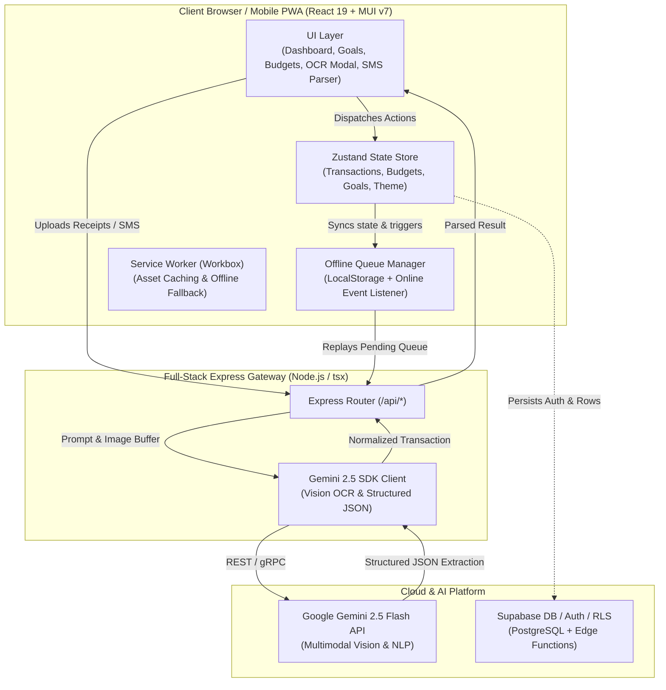

# RupeeMind System Architecture & Component Design

RupeeMind employs an AI-First reactive architecture combining a modern React 19 Single Page Application (PWA), local optimistic state caching, client-side background sync workers, and server-side Google Gemini 2.5 AI microservices.

---

## 1. High-Level Architecture Diagram

---

## 2. Core Subsystems

### A. AI Perception Pipeline (Gemini 2.5 Flash)
1. **Vision OCR (`/api/receipts/scan`)**: Accepts receipts (grocery, restaurant, retail invoices) in JPG/PNG/WEBP. It applies high-accuracy multimodal OCR to extract merchant names, line items, taxes, and automatically assigns a category.
2. **SMS Natural Language Parser (`/api/sms/parse`)**: Parses SMS templates across all Indian banking platforms, extracting amounts, debit/credit types, merchant names, and masked account identifiers with high accuracy.
3. **Savings Recommendation Engine (`/api/insights/generate`)**: Analyzes monthly velocity by comparing period-over-period category spending against preset targets.

### B. Offline Caching & Resilience
- **Optimistic State Updates**: UI updates instantly in memory via Zustand and persists to browser storage.
- **Offline Mutation Queue**: If mutations happen during network disruptions (`navigator.onLine === false`), transactions are enqueued to `OfflineSyncService` and synced upon reconnection.
- **Service Worker (PWA)**: Assets and Google Fonts are cached using CacheFirst and StaleWhileRevalidate strategies.

### C. Performance & Accessibility (WCAG AA)
- **Contrast compliance**: Evaluated for AAA/AA contrast against light `#F8FAFC` and dark `#090D16` surfaces.
- **Component Code Splitting**: Heavy dialogs and charts are modularized to keep the initial load lightweight.
- **Touch Targets**: Standard 44px+ touch targets on all interactive controls.
