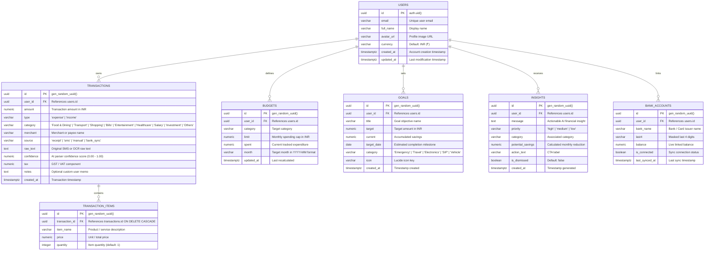

# RupeeMind Entity-Relationship (ER) Diagram

The database schema is designed for PostgreSQL with Supabase Row Level Security (RLS) enabled on all tables.



---

## Row Level Security (RLS) Policies

All tables enforce strict user isolation:
```sql
ALTER TABLE transactions ENABLE ROW LEVEL SECURITY;

CREATE POLICY "Users can only read and mutate their own transactions"
ON transactions
FOR ALL
USING (auth.uid() = user_id)
WITH CHECK (auth.uid() = user_id);
```
