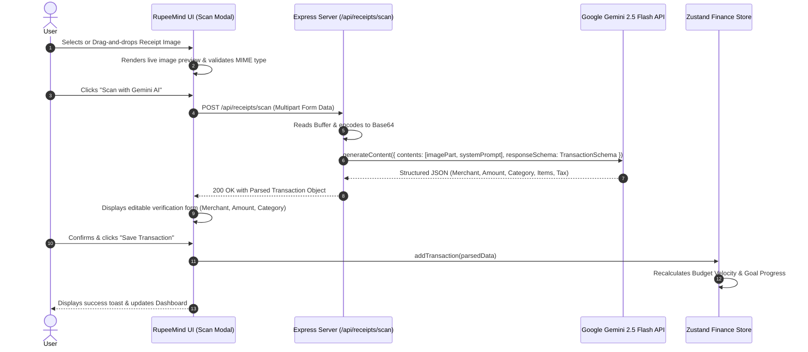
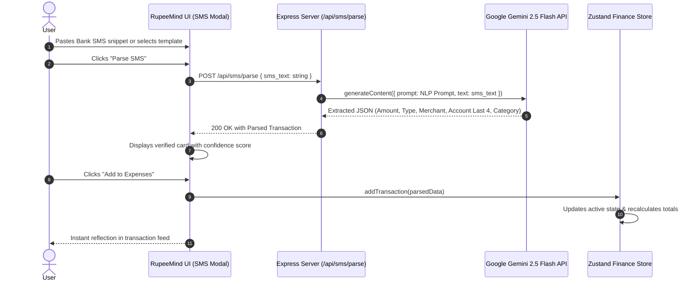
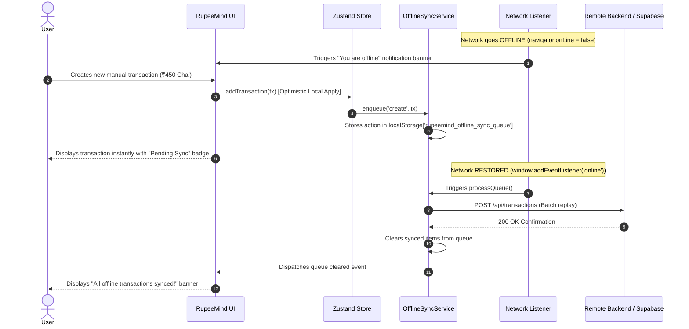

# RupeeMind End-to-End Sequence Diagrams

This document illustrates the execution lifecycle for the three primary workflows in RupeeMind.

---

## 1. Multimodal Receipt OCR Pipeline

---

## 2. Bank SMS Natural Language Parsing

---

## 3. Offline Transaction Caching & Reconnection Sync

